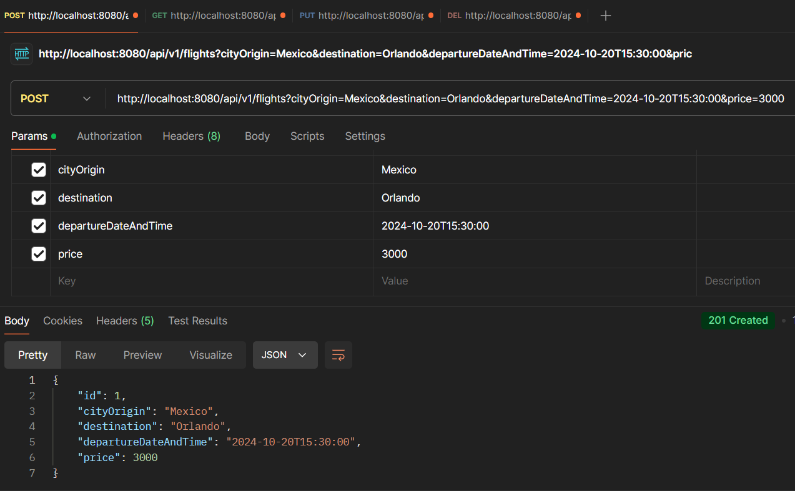
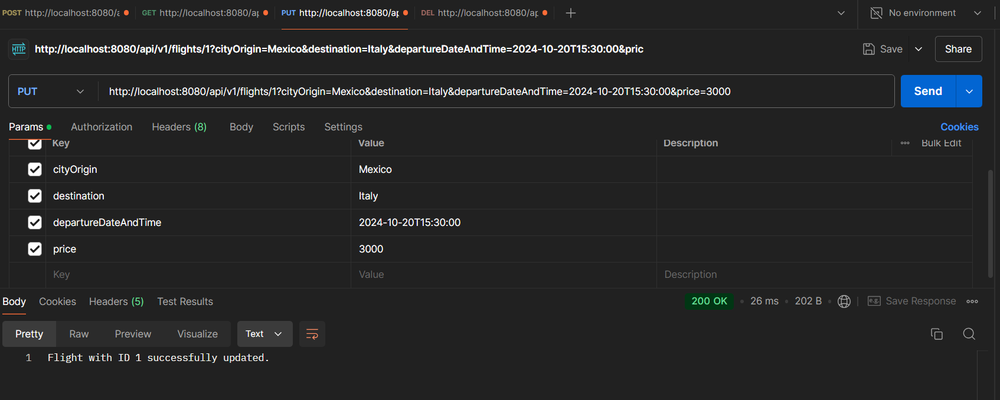
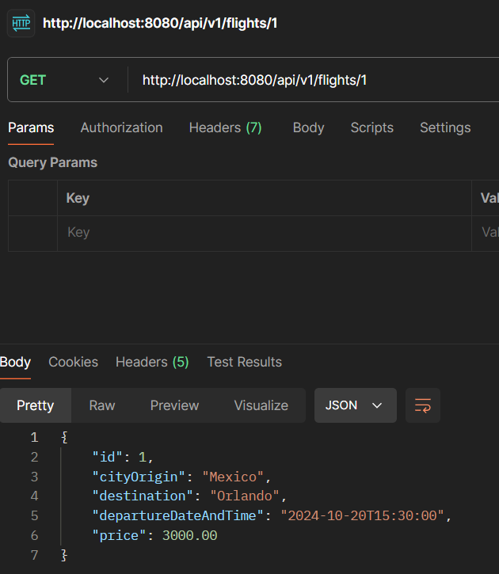
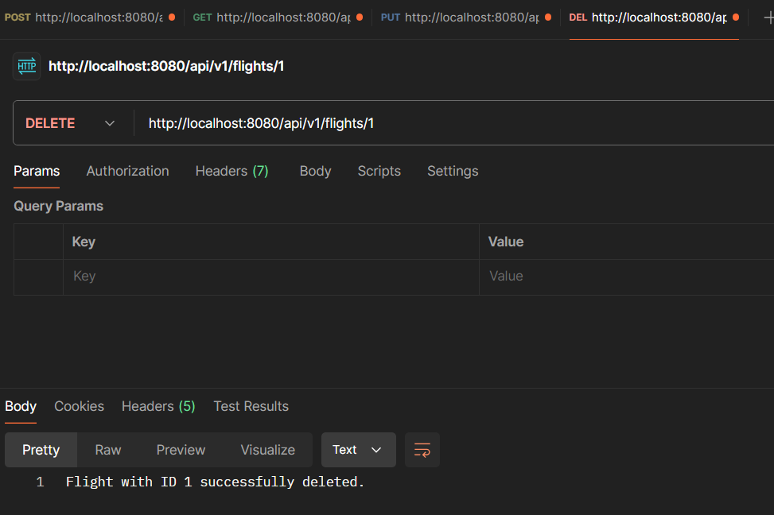

¡Perfecto! Aquí te presento la **documentación completa** del sistema con las secciones necesarias, explicaciones y los
códigos incluidos. Está estructurada para que tengas una visión clara de todo el proyecto.

---

## Documentación del Proyecto: Sistema de Reserva de Vuelos y Hoteles

### 1. Introducción del Proyecto

El **Sistema de Reserva de Vuelos y Hoteles** es una aplicación web que permite a los usuarios realizar reservas de
vuelos y hoteles de forma separada. El sistema gestiona las reservas mediante una API REST, implementando operaciones de
creación, actualización, eliminación y consulta de vuelos y hoteles.

El sistema está construido usando **Spring Boot** con **JPA** para la persistencia de datos y **Lombok** para reducir el
código repetitivo. Los datos se almacenan en una base de datos relacional, como **MySQL** o **H2** (para propósitos de
prueba).

### 2. Modelos

Los **modelos** representan las entidades principales del sistema, es decir, los datos que se manejan (vuelos y
hoteles). Cada modelo está anotado con **`@Entity`**, lo que le permite mapearse a una tabla de base de datos, y utiliza
**Lombok** para generar automáticamente getters y setters.

#### 2.1 Modelo `Hotel`

El modelo **Hotel** representa la entidad que almacena los datos de una reserva de hotel, como el nombre del hotel, la
ciudad, la fecha de check-in y el precio por noche.

```java
package com.tcs.airline.model;

import jakarta.persistence.Entity;
import jakarta.persistence.GeneratedValue;
import jakarta.persistence.GenerationType;
import jakarta.persistence.Id;
import lombok.Data;

import java.math.BigDecimal;
import java.time.LocalDate;

@Data
@Entity
public class Hotel {

    @Id
    @GeneratedValue(strategy = GenerationType.IDENTITY)
    private int id;
    private String hotelName;
    private String city;
    private LocalDate checkinDate;
    private BigDecimal pricePerNight;

}
```

#### 2.2 Modelo `Flights`

El modelo **Flights** representa una reserva de vuelo, con atributos como la ciudad de origen, el destino, la fecha y
hora de salida, y el precio del vuelo.

```java
package com.tcs.airline.model;

import jakarta.persistence.Entity;
import jakarta.persistence.GeneratedValue;
import jakarta.persistence.GenerationType;
import jakarta.persistence.Id;
import lombok.Data;

import java.math.BigDecimal;
import java.time.LocalDateTime;

@Data
@Entity
public class Flights {
    @Id
    @GeneratedValue(strategy = GenerationType.IDENTITY)
    private int id;
    private String cityOrigin;
    private String destination;
    private LocalDateTime departureDateAndTime;
    private BigDecimal price;
}
```

### 3. Repositorios

Los **repositorios** permiten interactuar con la base de datos. Estos extienden la interfaz **`JpaRepository`**, que
proporciona los métodos CRUD predefinidos (Create, Read, Update, Delete).

#### 3.1 Repositorio `HotelRepository`

El repositorio **HotelRepository** maneja las operaciones CRUD para la entidad **Hotel**.

```java
package com.tcs.airline.repository;

import com.tcs.airline.model.Hotel;
import org.springframework.data.jpa.repository.JpaRepository;
import org.springframework.stereotype.Repository;

@Repository
public interface HotelRepository extends JpaRepository<Hotel, Integer> {
}
```

#### 3.2 Repositorio `FlightsRepository`

El repositorio **FlightsRepository** maneja las operaciones CRUD para la entidad **Flights**.

```java
package com.tcs.airline.repository;

import com.tcs.airline.model.Flights;
import org.springframework.data.jpa.repository.JpaRepository;
import org.springframework.stereotype.Repository;

@Repository
public interface FlightRepository extends JpaRepository<Flights, Integer> {
}
```

### 4. Servicios

Los **servicios** son los responsables de la lógica de negocio. Aquí es donde se definen las operaciones para crear,
actualizar, eliminar y consultar vuelos y hoteles.

#### 4.1 Servicio `HotelService`

El **HotelService** implementa la lógica de negocio para gestionar las operaciones relacionadas con hoteles.

```java
package com.tcs.airline.services;

import com.tcs.airline.model.Hotel;
import com.tcs.airline.repository.HotelRepository;
import org.springframework.beans.factory.annotation.Autowired;
import org.springframework.stereotype.Service;

import java.math.BigDecimal;
import java.time.LocalDate;
import java.util.Optional;

@Service
public class HotelService {

    @Autowired
    HotelRepository hotelRepository;

    // CreateHotel
    public Hotel registeHotel(String hotelName, String city, LocalDate checkinDate, BigDecimal pricePerNight) {
        Hotel hotel = new Hotel();
        hotel.setHotelName(hotelName);
        hotel.setCity(city);
        hotel.setCheckinDate(checkinDate);
        hotel.setPricePerNight(pricePerNight);
        return hotelRepository.save(hotel);
    }

    // DeleteHotelById
    public String deleteHotelById(int id) {
        Optional<Hotel> hotel = hotelRepository.findById(id);
        if (hotel.isPresent()) {
            hotelRepository.deleteById(id);
            return "Hotel with id " + id + " was deleted";
        } else {
            return "Hotel with id " + id + " not found";
        }
    }

    // UpdateHotel
    public String updateHotel(int id, String hotelName, String city, LocalDate checkinDate, BigDecimal pricePerNight) {
        Optional<Hotel> hotel = hotelRepository.findById(id);
        if (hotel.isPresent()) {
            Hotel existingHotel = hotel.get();
            existingHotel.setHotelName(hotelName);
            existingHotel.setCity(city);
            existingHotel.setCheckinDate(checkinDate);
            existingHotel.setPricePerNight(pricePerNight);
            hotelRepository.save(existingHotel);
            return "Hotel with id " + id + " was updated";
        } else {
            return "Hotel with id " + id + " not found";
        }
    }

    // GetHotelById
    public Hotel getHotelById(int id) {
        Optional<Hotel> hotel = hotelRepository.findById(id);
        if (hotel.isPresent()) {
            return hotel.get();
        } else {
            throw new RuntimeException("Hotel with id " + id + " not found");
        }
    }
}
```

#### 4.2 Servicio `FlightsService`

El **FlightsService** implementa la lógica de negocio para gestionar las operaciones relacionadas con vuelos.

```java
package com.tcs.airline.services;

import com.tcs.airline.model.Flights;
import com.tcs.airline.repository.FlightRepository;
import org.springframework.beans.factory.annotation.Autowired;
import org.springframework.stereotype.Service;

import java.math.BigDecimal;
import java.time.LocalDateTime;
import java.util.Optional;

@Service
public class FlightsService {

    @Autowired
    private FlightRepository flightRepository;

    // CreateFlight
    public Flights createFlight(String cityOrigin, String destination, LocalDateTime departureDateAndTime, BigDecimal price) {
        Flights flight = new Flights();
        flight.setCityOrigin(cityOrigin);
        flight.setDestination(destination);
        flight.setDepartureDateAndTime(departureDateAndTime);
        flight.setPrice(price);
        return flightRepository.save(flight);
    }

    // DeleteFlightById
    public String deleteFlightById(int id) {
        Optional<Flights> flight = flightRepository.findById(id);
        if (flight.isPresent()) {
            flightRepository.deleteById(id);
            return "Flight with ID " + id + " successfully deleted.";
        } else {
            return "Flight with ID " + id + " not found.";
        }
    }

    // UpdateFlight
    public String updateFlight(int id, String cityOrigin, String destination, LocalDateTime departureDateAndTime, BigDecimal price) {
        Optional<Flights> flight = flightRepository.findById(id);
        if (flight.isPresent()) {
            Flights existingFlight = flight.get();
            existingFlight.setCityOrigin(cityOrigin);
            existingFlight.setDestination(destination);
            existingFlight.setDepartureDateAndTime(departureDateAndTime);
            existingFlight.setPrice(price);
            flightRepository.save(existingFlight);
            return "Flight with ID " + id + " successfully updated.";
        } else {
            return "Flight with ID " + id + " not found.";
        }
    }

    // GetFlightById
    public Flights getFlightById(int id) {
        Optional<Flights> flight = flightRepository.findById(id);
        if (flight.isPresent()) {
            return flight.get();
        } else {
            throw new RuntimeException("Flight with ID " + id + " not found.");
        }
    }
}
```

### 5. Controladores

Los **controladores** exponen la API REST para que los clientes (Postman, aplicaciones frontend, etc.) puedan
interactuar con el sistema. Aquí se mapean las solicitudes HTTP con las operaciones de los servicios.

#### 5.1 Controlador `HotelController`

El **HotelController** gestiona las solicitudes HTTP relacionadas con los hoteles.

```java
package com.tcs.airline.controller;

import com.tcs.airline.model.Hotel;
import com.tcs.airline.services.HotelService;
import org.springframework.beans.factory.annotation.Autowired;
import org.springframework.http.HttpStatus;
import org.springframework.http.ResponseEntity;
import org.springframework.web.bind.annotation.*;

import java.math.BigDecimal;
import java.time.LocalDate;

@RestController
@RequestMapping("/api/v1/hotels")
public class HotelController {

    @Autowired
    private HotelService hotelService;

    // CreateHotel
    @PostMapping
    public ResponseEntity<Hotel> createHotel(
            @RequestParam String hotelName,
            @RequestParam String city,
            @RequestParam LocalDate checkinDate,
            @

                    RequestParam BigDecimal pricePerNight) {
        try {
            Hotel createdHotel = hotelService.registeHotel(hotelName, city, checkinDate, pricePerNight);
            return new ResponseEntity<>(createdHotel, HttpStatus.CREATED);
        } catch (Exception e) {
            return new ResponseEntity<>(null, HttpStatus.INTERNAL_SERVER_ERROR);
        }
    }

    // DeleteHotelById
    @DeleteMapping("/{id}")
    public ResponseEntity<String> deleteHotelById(@PathVariable int id) {
        try {
            String result = hotelService.deleteHotelById(id);
            return new ResponseEntity<>(result, HttpStatus.OK);
        } catch (Exception e) {
            return new ResponseEntity<>("Error deleting hotel.", HttpStatus.INTERNAL_SERVER_ERROR);
        }
    }

    // UpdateHotel
    @PutMapping("/{id}")
    public ResponseEntity<String> updateHotel(
            @PathVariable int id,
            @RequestParam String hotelName,
            @RequestParam String city,
            @RequestParam LocalDate checkinDate,
            @RequestParam BigDecimal pricePerNight) {
        try {
            String result = hotelService.updateHotel(id, hotelName, city, checkinDate, pricePerNight);
            if (result.contains("was updated")) {
                return new ResponseEntity<>(result, HttpStatus.OK);
            } else {
                return new ResponseEntity<>(result, HttpStatus.NOT_FOUND);
            }
        } catch (Exception e) {
            return new ResponseEntity<>("Error updating hotel.", HttpStatus.INTERNAL_SERVER_ERROR);
        }
    }

    // GetHotelById
    @GetMapping("/{id}")
    public ResponseEntity<Hotel> getHotelById(@PathVariable int id) {
        try {
            Hotel hotel = hotelService.getHotelById(id);
            return new ResponseEntity<>(hotel, HttpStatus.OK);
        } catch (Exception e) {
            return new ResponseEntity<>(null, HttpStatus.NOT_FOUND);
        }
    }
}
```

#### 5.2 Controlador `FlightsController`

El **FlightsController** gestiona las solicitudes HTTP relacionadas con los vuelos.

```java
package com.tcs.airline.controller;

import com.tcs.airline.model.Flights;
import com.tcs.airline.services.FlightsService;
import org.springframework.beans.factory.annotation.Autowired;
import org.springframework.http.HttpStatus;
import org.springframework.http.ResponseEntity;
import org.springframework.web.bind.annotation.*;

import java.math.BigDecimal;
import java.time.LocalDateTime;

@RestController
@RequestMapping("/api/v1/flights")
public class FlightsController {

    @Autowired
    private FlightsService flightsService;

    // CreateFlight
    @PostMapping
    public ResponseEntity<Flights> createFlight(
            @RequestParam String cityOrigin,
            @RequestParam String destination,
            @RequestParam LocalDateTime departureDateAndTime,
            @RequestParam BigDecimal price) {
        try {
            Flights createdFlight = flightsService.createFlight(cityOrigin, destination, departureDateAndTime, price);
            return new ResponseEntity<>(createdFlight, HttpStatus.CREATED);
        } catch (Exception e) {
            return new ResponseEntity<>(null, HttpStatus.INTERNAL_SERVER_ERROR);
        }
    }

    // DeleteFlightById
    @DeleteMapping("/{id}")
    public ResponseEntity<String> deleteFlightById(@PathVariable int id) {
        try {
            String result = flightsService.deleteFlightById(id);
            return new ResponseEntity<>(result, HttpStatus.OK);
        } catch (Exception e) {
            return new ResponseEntity<>("Error deleting flight.", HttpStatus.INTERNAL_SERVER_ERROR);
        }
    }

    // UpdateFlight
    @PutMapping("/{id}")
    public ResponseEntity<String> updateFlight(
            @PathVariable int id,
            @RequestParam String cityOrigin,
            @RequestParam String destination,
            @RequestParam LocalDateTime departureDateAndTime,
            @RequestParam BigDecimal price) {
        try {
            String result = flightsService.updateFlight(id, cityOrigin, destination, departureDateAndTime, price);
            if (result.contains("successfully updated")) {
                return new ResponseEntity<>(result, HttpStatus.OK);
            } else {
                return new ResponseEntity<>(result, HttpStatus.NOT_FOUND);
            }
        } catch (Exception e) {
            return new ResponseEntity<>("Error updating flight.", HttpStatus.INTERNAL_SERVER_ERROR);
        }
    }

    // GetFlightById
    @GetMapping("/{id}")
    public ResponseEntity<Flights> getFlightById(@PathVariable int id) {
        try {
            Flights flight = flightsService.getFlightById(id);
            return new ResponseEntity<>(flight, HttpStatus.OK);
        } catch (Exception e) {
            return new ResponseEntity<>(null, HttpStatus.NOT_FOUND);
        }
    }
}
```

### 6. Instrucciones para probar la API

Puedes probar la API utilizando herramientas como **Postman** para enviar solicitudes HTTP a los diferentes endpoints.

#### Ejemplos de solicitudes:

1. **Crear un vuelo (POST)**:
   ```
   POST http://localhost:8080/api/v1/flights
   ```
   
    - Parámetros (x-www-form-urlencoded):
        - `cityOrigin`: "Mexico City"
        - `destination`: "Orlando"
        - `departureDateAndTime`: "2024-10-20T15:30:00"
        - `price`: 3000.00


2. **Eliminar un vuelo (DELETE)**:
   ```
   DELETE http://localhost:8080/api/v1/flights/1
   ```

3. **Actualizar un vuelo (PUT)**:
   
   ```
   PUT http://localhost:8080/api/v1/flights/1
   ```
    - Parámetros (x-www-form-urlencoded):
        - `cityOrigin`: "Mexico City"
        - `destination`: "Italy"
        - `departureDateAndTime`: "2024-11-15T10:00:00"
        - `price`: 3000.00

4. **Consultar un vuelo por ID (GET)**:
   ```
   GET http://localhost:8080/api/v1/flights/1
   ```



5. **Crear un hotel (POST)**:
   

```
   POST http://localhost:8080/api/v1/hotels
   ```

    - Parámetros (x-www-form-urlencoded):
        - `hotelName`: "Hyatt"
        - `city`: "New York"
        - `checkinDate`: "2024-11-10"
        - `pricePerNight`: 150.00

### 7. Conclusión

El **Sistema de Reserva de Vuelos y Hoteles** proporciona una solución sencilla pero efectiva para gestionar reservas de
vuelos y hoteles mediante una API REST. El uso de **Spring Boot**, **JPA**, y **Lombok** facilita la implementación y el
manejo del sistema. Con este enfoque, es posible seguir agregando funcionalidades y mejorando el sistema para incluir
más características en el futuro.

---
